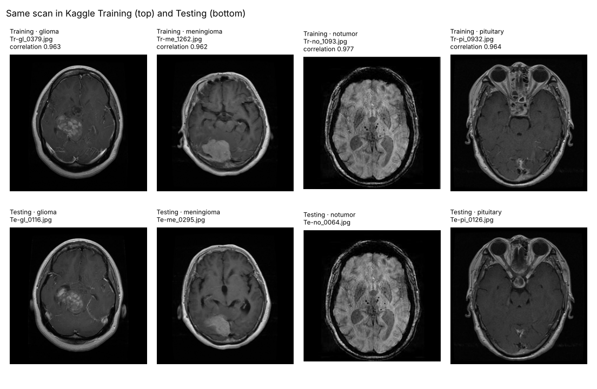
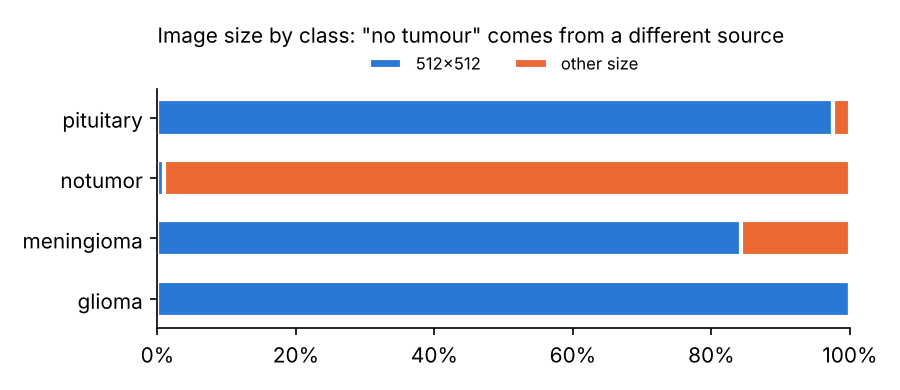
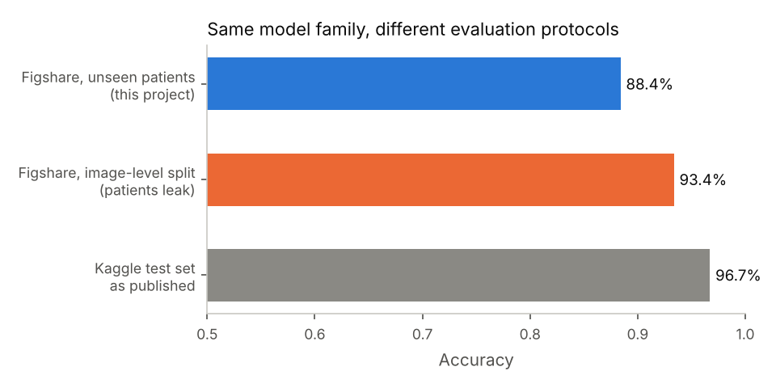
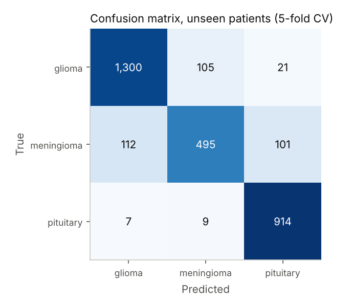
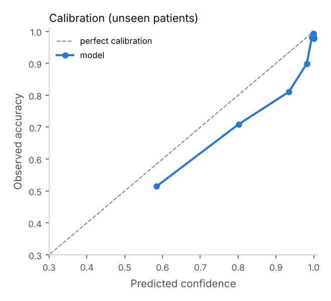
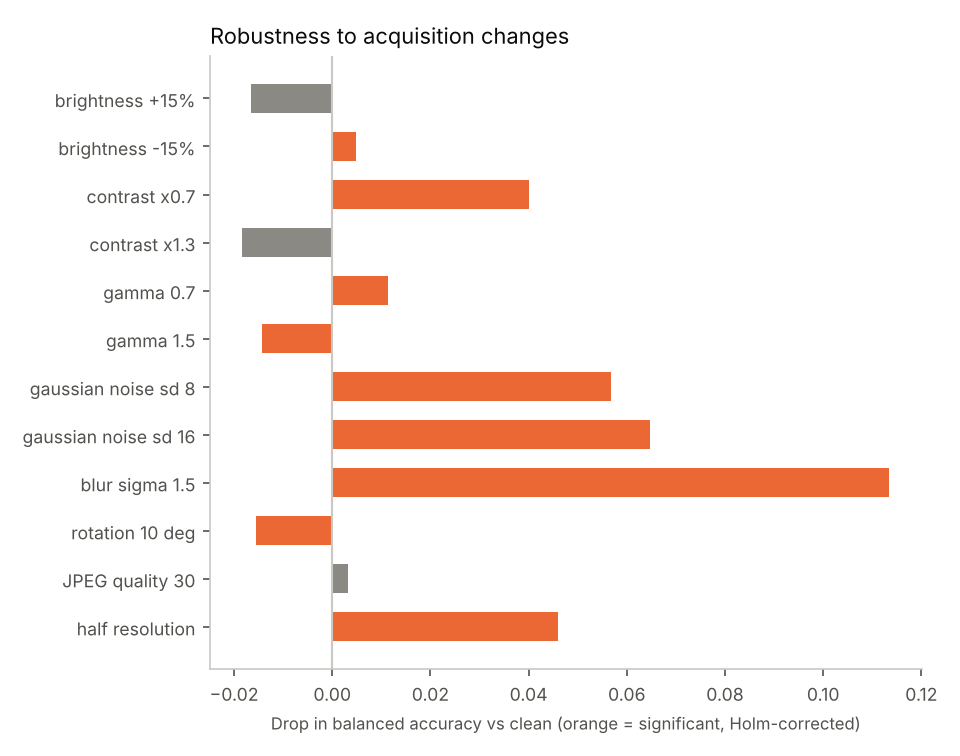
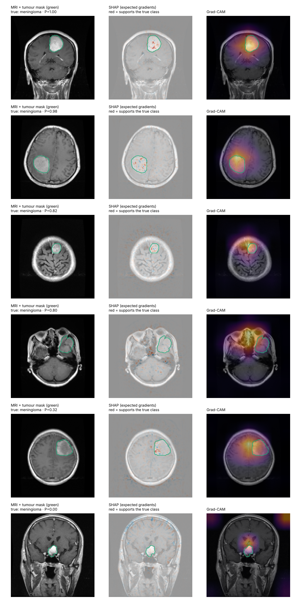

# BrainGuard: how much of brain-tumour MRI accuracy is real?

[](https://github.com/Muneera-DSA/BrainGuard-MRI-Tumor-Detection/actions/workflows/ci.yml)

Public brain-tumour MRI classifiers routinely report 95–99% accuracy. This project asks whether those numbers measure tumour recognition, or something easier. It has two parts:

1. **An audit of the most popular benchmark.** The Kaggle *Brain Tumor MRI Dataset* (7,023 images) is checked for duplicate scans, patient overlap between Training and Testing, and source shortcuts.
2. **A model that is evaluated so that leakage is impossible.** EfficientNetB0 is trained on the figshare dataset of Cheng et al. (3,064 slices, **233 patients with IDs and tumour masks**) using patient-grouped cross-validation. It is then subjected to pre-registered hypothesis tests, robustness tests, and SHAP / Grad-CAM explanations that are scored against the radiologists' tumour outlines.

> **Status:** complete. Every number below comes from committed code: Part 1 from the audit scripts, Part 2 from one GPU run of `notebooks/run_on_colab.ipynb` (full output in [`reports/results.md`](reports/results.md)).

### Key findings

| Question | Answer |
|---|---|
| How accurate is the model on patients it has never seen? | **Balanced accuracy 86.5%** (95% CI 83.5–89.1%), macro AUC 0.971 |
| Where does it fail? | **Meningioma: 69.9% sensitivity**, about 3 in 10 missed, against 91–98% for the other two types |
| How much does patient leakage inflate the score? | **+5.1 points**: 91.6% when slices of one patient are split across train and test |
| Does the Kaggle benchmark flatter models? | Yes. 96.7% overall, but **99.3% on test images with a copy in Training vs 93.7% without** (p = 5.5e-09) |
| Does transfer learning beat the original BrainGuard CNN? | **No evidence**: 86.5% vs 87.2% (p = 1.0) |
| Do the explanations point at the tumour? | **Above chance, but weakly**; Grad-CAM passes the sanity check, SHAP does not |

---

## Part 1: what is wrong with the Kaggle benchmark

All numbers are generated by `python -m brainguard.audit`, `brainguard.shortcut` and `brainguard.crosswalk`. Full tables are in [`reports/`](reports).

### 1a. Half the test set is already in the training set

Duplicates are detected in two steps:
1. **Candidates:** images whose perceptual hashes are similar.
2. **Confirmation:** a 64×64 pixel correlation of at least 0.95.

Hash similarity alone is not enough. Among hash-similar pairs with correlation below 0.80, half carry different tumour labels; they are different brains. Above 0.95, **1 of 7,609 pairs** disagrees on the label.

| How strictly "the same scan" is defined | Testing images with a copy in Training |
|---|---|
| Identical file bytes | 103 (7.9%) |
| Pixel correlation ≥ 0.995 (visually identical) | 477 (36.4%) |
| **Pixel correlation ≥ 0.95 (same scan, re-saved or resized), the definition used here** | **710 (54.2%)** |



### 1b. Testing patients are Training patients

Most Kaggle tumour images are re-encoded figshare slices. Matching each one to its figshare original recovers the **patient ID**:
- **114 of the 120 figshare patients in Kaggle Testing also appear in Kaggle Training.**
- **171 of 178 matched Testing images (96%) come from a patient the model trained on.**

This is a lower bound: only identical slices are matched, so neighbouring slices of the same patient are missed ([`reports/kaggle_crosswalk.md`](reports/kaggle_crosswalk.md)).

### 1c. The labels can be predicted without looking at the brain

The "no tumour" images come from a different source:
- **Different image sizes:** 99% are not 512×512, while every glioma image is.
- **Different MRI sequences:** on visual inspection, mostly T2/FLAIR, while the tumour images are contrast-enhanced T1.

A gradient-boosting model given **only file properties** (width, height, colour mode, file size, no pixels) scores on Kaggle Testing:

| Task | File properties only |
|---|---|
| Tumour vs no tumour | **AUC 0.984** (95% CI 0.978–0.990), accuracy 94.0% |
| One rule: "not 512×512 → no tumour" | accuracy 90.5% |
| 4 classes | accuracy 67.1% (majority class: 30.9%) |



**Conclusion:**
- A high accuracy on this benchmark is not evidence of tumour recognition.
- The tumour-vs-no-tumour task in particular cannot be validated with this data.
- That is why Part 2 uses a dataset with patient IDs and a single source, and restricts the claim to **tumour type**.

---

## Part 2: a tumour-type classifier validated on unseen patients

| | |
|---|---|
| **Task** | Glioma vs meningioma vs pituitary tumour, from one contrast-enhanced T1 slice |
| **Decision supported** | Second-reader triage of tumour type. A research prototype, **not** a diagnostic device (see [`MODEL_CARD.md`](MODEL_CARD.md)) |
| **Data** | figshare, Cheng et al. (CC BY 4.0): 3,064 slices, 233 patients (glioma 1,426 / 89; meningioma 708 / 82; pituitary 930 / 62) |
| **Validation** | 5-fold cross-validation **grouped by patient**: every prediction is for a patient the model never saw. Early stopping uses a separate 15% of the *training* patients, never the evaluation fold |
| **Model** | EfficientNetB0 (ImageNet), head first, then the top 30% of the backbone fine-tuned; mild anatomy-preserving augmentation |
| **Imbalance** | Class shares 47/23/30%. Metrics are balanced accuracy and per-class sensitivity, not accuracy alone. Class weighting is tested as a hypothesis, not assumed |
| **Uncertainty** | Every CI is a patient-level bootstrap (2,000 draws); paired tests on the same images |

### Hypotheses tested (Holm-corrected)

| # | Hypothesis | Test |
|---|---|---|
| H1 | Image-level CV overstates accuracy versus patient-level CV (leakage) | Same model and folds, McNemar + patient bootstrap |
| H2 | Transfer learning beats the original BrainGuard CNN | McNemar on the same images |
| H3 | Class weighting improves balanced accuracy | McNemar + per-class sensitivity |
| H4 | Meningioma is detected less reliably than the other classes | Patient-bootstrap difference in sensitivity |
| H5 | Kaggle-style accuracy is inflated by copies and shared patients | Fisher exact, test images with vs without a Training copy / patient |
| H6 | SHAP attributions concentrate on the tumour more than chance | Wilcoxon: attribution share inside the tumour mask vs mask area |

### Further validity checks

- **Robustness.** Each fold model re-scores its own held-out patients under brightness, contrast, gamma, noise, blur, rotation, JPEG and resolution changes. Each change is paired with the clean image and tested with McNemar (Holm-corrected).
- **Explanation sanity check** (Adebayo et al., 2018). Maps from a randomly initialised model must *not* resemble the trained model's; otherwise they show image structure rather than learning.
- **SHAP completeness.** Attributions must add up to the change in model output. The expected-gradients implementation is cross-checked against `shap.GradientExplainer`.
- **Calibration.** Expected calibration error, Brier score and a reliability diagram.

### Results

95% confidence intervals come from a patient-level bootstrap. p-values are Holm-adjusted. Source: [`reports/results.md`](reports/results.md).

**Main model** (EfficientNetB0; 3,064 images from 233 patients; every prediction is for an unseen patient):

| Metric | Value (95% CI) |
|---|---|
| Balanced accuracy | **86.5%** (83.5–89.1%) |
| Accuracy | 88.4% (85.5–91.1%) |
| Macro one-vs-rest AUC | 0.971 (0.951–0.985) |
| Macro F1 / Cohen's κ | 0.865 / 0.818 |
| Calibration: ECE / Brier | 0.045 / 0.170 |
| Variation across the 5 folds | 88.4% ± 1.6% (SD) |



| Tumour type | Images | Sensitivity | Precision | AUC |
|---|---|---|---|---|
| Glioma | 1,426 | 91.2% (87.6–94.6%) | 91.6% | 0.981 |
| Meningioma | 708 | **69.9% (62.0–77.5%)** | 81.3% | 0.941 |
| Pituitary | 930 | 98.3% (96.2–99.8%) | 88.2% | 0.990 |

<p> </p>

**Meningioma errors go both ways:** 112 are called glioma and 101 pituitary. **Calibration** is reasonable overall (ECE 0.045), but the model is **over-confident in its uncertain range**: when it reports about 80% confidence it is right about 71% of the time.

**Hypothesis tests:**

| # | Hypothesis | Result | p (Holm) | Verdict |
|---|---|---|---|---|
| H1 | Image-level CV overstates accuracy (leakage) | 91.6% vs 86.5% balanced accuracy | 2.9e-22 | **Supported** |
| H2 | Transfer learning beats the baseline CNN | 86.5% vs 87.2% (CNN slightly higher) | 1.0 | Not supported |
| H3 | Class weighting improves balanced accuracy | 87.6% vs 86.5% | 0.4 | Not supported |
| H4 | Meningioma is detected less reliably | sensitivity −24.1 points (CI −32.3 to −16.4) | 0.002 | **Supported** |
| H5a | Kaggle accuracy is higher when the test image has a copy in Training | 99.3% vs 93.7% | 2.7e-08 | **Supported** |
| H5b | Kaggle accuracy is higher when the test patient is in Training | 97.7% vs 96.6% | 1.0 | Not supported |
| H6 | SHAP attribution concentrates on the tumour more than chance | 3.5% inside vs 1.2% tumour area | 9.5e-25 | **Supported**, see caveat |

**Robustness.** Accuracy is stable under brightness, gamma, rotation (10°), stronger contrast and JPEG compression (change ≤ 1.7 points). It degrades under **blur (−11.3 points), noise (−5.7 to −6.5), half resolution (−4.6) and reduced contrast (−4.0)**, all significant after Holm correction.



**Explanations.** The 150 held-out images were each explained by the fold model that never saw the patient, and scored against the radiologists' tumour masks:
- Attribution falls on the tumour about 2–2.5× more than chance. SHAP's highest point lands inside the tumour in 32.7% of images (chance: 2.2%).
- In absolute terms, though, **most attribution lies outside the tumour** (median 3.5% inside for SHAP, 2.5% for Grad-CAM).
- **Sanity check:**
  - Grad-CAM maps change completely when the learned weights are replaced with random ones (rank similarity 0.16), so they reflect what the model learned.
  - SHAP maps barely change (similarity 0.77), so here they mostly show image structure (edges, bright tissue), not the model's reasoning.
  - These sanity figures are medians over 25 images; a randomly initialised copy of each fold model is used.
  - SHAP completeness holds (r = 0.91), and the implementation agrees with the `shap` library's `GradientExplainer` (r = 0.77–0.95 on 3 test images). The issue is *what* the attributions track, not the arithmetic.



*Six held-out meningioma slices, from most to least confident (P = the model's probability for the true class). Green = the radiologist's tumour outline.*
- *Grad-CAM (right) covers the tumour in the top three cases but not the fourth, which is still classified correctly.*
- *SHAP (middle) is fine-grained speckle; the sanity check shows its pattern changes little when the learned weights are removed.*
- *The bottom case is a meningioma next to the pituitary gland. The model calls it pituitary with 99.99% confidence: it appears to rely on **location**, a plausible but fragile cue, and it is confidently wrong.*

### What the results mean

1. **The honest figure is about 86–87% balanced accuracy on new patients**, not the 95–99% common on Kaggle. The gap is explained by measurable leakage (H1, H5a), not by a weaker model.
2. **Meningioma is the clinical weak point.** About 3 in 10 meningioma slices are called something else. As a second reader, the model should not be used to rule meningioma out.
3. **The original small CNN is as good as EfficientNetB0** once both are evaluated properly. The larger model's advantage on leaky benchmarks does not carry over.
4. **Class weighting is not needed**: the imbalance (47/23/30%) is moderate, and re-weighting gave no significant gain (H3).
5. **Confidence needs re-calibration before use.** Over-confidence in the 60–95% range means scores should be re-calibrated, for example with temperature scaling fitted on the early-stopping patients, before they are shown as probabilities.
6. **Image-quality shift is the main deployment risk.** Blurred, noisy or low-resolution scans cost 5–11 points. A scanner or protocol unlike the training hospitals' could cost more, and only an external test set can measure that.
7. **The explanations cannot be used as tumour localisation.** Grad-CAM is the trustworthy one here. A SHAP heat-map that "looks right" on an MRI is not evidence on its own: this project shows how to test it.

---

## Reproduce

**Data audit** (CPU, about 3 minutes; needs the Kaggle zip):

```bash
pip install -e .
# Kaggle zip extracted to data/kaggle/{Training,Testing}
python -m brainguard.audit && python -m brainguard.shortcut
python -m brainguard.figshare          # downloads ~880 MB from figshare and converts it
python -m brainguard.crosswalk
```

**Full study** (GPU): open [`notebooks/run_on_colab.ipynb`](notebooks/run_on_colab.ipynb) in Google Colab with a T4 GPU and run all cells. It takes 1.5–2.5 hours and resumes after a disconnect. Or locally:

```bash
pip install -e ".[dl]"
python -m brainguard.pipeline --kaggle-zip Brain_tumor_Image_dataset.zip
```

**Rebuild every result without a GPU:** the run's saved predictions are committed in [`results/`](results).

```bash
python -m brainguard.report --artifacts-dir results --reports-dir /tmp/check   # identical to reports/results.md
```

**Tests:** `pip install -e ".[dev]" && pytest`. Deep-learning tests run on tiny synthetic images when TensorFlow is installed; CI runs both suites.

## Project structure

```
src/brainguard/
  audit.py        duplicates (hash + pixel correlation), label conflicts, source confounding
  shortcut.py     can file properties alone predict the label?
  figshare.py     download + convert the Cheng et al. .mat files (h5py or system libhdf5)
  crosswalk.py    match Kaggle images to figshare slices -> patient IDs -> patient overlap
  splits.py       patient-grouped and image-level folds
  tfdata.py       tf.data pipeline
  models.py       baseline CNN, EfficientNetB0
  train.py        cross-validated experiments, resumable
  robustness.py   acquisition-shift perturbations
  explain.py      SHAP (expected gradients), Grad-CAM, localisation vs masks, sanity check
  stats.py        Wilson, DeLong, McNemar, Fisher, patient bootstrap, ECE, Holm
  report.py       results.md + figures from saved predictions
  pipeline.py     everything, end to end
notebooks/run_on_colab.ipynb
reports/          generated reports and figures
results/          predictions from the GPU run (every image, every fold) and explanation scores
tests/            unit + end-to-end tests (synthetic data)
```

## Relation to the original BrainGuard notebooks

The original notebooks reported 76% (4-class CNN, Kaggle) and 97% (binary CNN, BRISC 2025). Both evaluated on test sets that share scans with training data. The BRISC audit had already flagged 313 test images with near-duplicates in training; with no patient IDs, they could not be removed reliably. This repository replaces those numbers with a protocol under which leakage cannot occur, and keeps the original CNN as baseline H2.

## Data and licences

- **Kaggle *Brain Tumor MRI Dataset*** (M. Nickparvar), described by its author as a compilation of figshare, SARTAJ and Br35H. Images are not redistributed here.
- **figshare** brain tumour dataset, J. Cheng, CC BY 4.0, <https://doi.org/10.6084/m9.figshare.1512427>. Cite: Cheng J. et al., *Enhanced performance of brain tumor classification via tumor region augmentation and partition*, PLoS ONE 10(10), 2015.

---

**Author:** Muneera Mohamed · MSc Data Science · CMA (USA) · [GitHub](https://github.com/Muneera-DSA)
